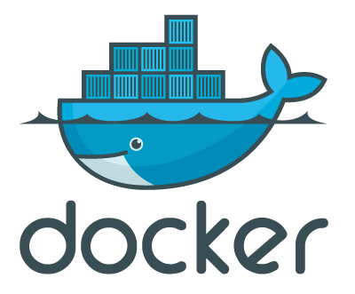

<p align="center">

</p>

> 📘 **New here?** Read the **[Home Server Guide](HOME-SERVER-GUIDE.md)** — the
> whole setup explained in plain English, plus a per-service table and
> troubleshooting cheatsheet.

# Services

* [pihole](pihole/) - network-wide ad blocker (your DNS / phone book)
* [traefik](traefik/) - reverse proxy and SSL manager
* [jellyfin](jellyfin/) - media system (your personal Netflix)
* [jellyseer](jellyseer/) - media request page (runs Seerr)
* [prowlarr](prowlarr/) - indexer manager for the *arr apps
* [radarr](radarr/) - movie collection manager
* [sonarr](sonarr/) - TV show collection manager
* [bazarr](bazarr/) - subtitle manager
* [qbittorrent](qbittorrent/) - torrent client
* [vaultwarden](vaultwarden/) - self-hosted password manager
* [uptime-kuma](uptime-kuma/) - monitoring and status pages
* [transmission](transmission/) - alternative torrent client (not currently running)
* [watchtower](watchtower/) - automatic docker image updates

# Information

The overall guide is centered around examples. Each of the services is tied with either a docker-compose or a script, everything has been made so that each service is almost ready to use, only a few user-specific variables are required.

All services respect a certain format :

- **About** - basic overview of the service
- **Table of Contents**
- **Files structure** - lists all the files and folder required
- **Information** - detailed information about the service and the example
- **Usage** - required configuration and commands to use the service
- **Update** - how to update the container, most of the time it is using watchtower
- **Backup** - how to back up the container, most of the time it is using a manual tar backup

Traefik is the core of this setup as it is the reverse proxy, it should be one of the first services to configure and use.

# Structure

The root `docker-compose.yml` ties the main stack together with `extends` — each
service keeps its own `docker-compose.yml` in its folder, and the root file
re-states the things `extends` cannot carry over (e.g. `depends_on`, and
top-level `.env` variables).

```
home-server/
├── docker-compose.yml      # root stack: traefik + socket-proxy + all services
├── .env                    # domain, Cloudflare key, timezone, URLs (gitignored)
├── scripts/                # deploy + health-check scripts (see below)
├── traefik/  pihole/  jellyfin/  jellyseer/  prowlarr/  radarr/
├── sonarr/  bazarr/  qbittorrent/  vaultwarden/  uptime-kuma/
├── transmission/           # alternative downloader (not in root stack)
├── watchtower/             # auto-updater
├── wedding-website-production/   # wedding site source (git-tracked)
└── wedding-website-staging/      # generated from develop — do not edit
```

Services started outside the root stack (run them from their own folder with
`docker compose up -d`): **pihole** and **transmission**.

## Wedding website

The wedding site is part of the root stack as two services —
`wedding-website` (production) and `staging-website` — both defined via
`extends` in the root `docker-compose.yml`.

`wedding-website-production/` holds the source; `wedding-website-staging/` is a
**generated mirror** of the `develop` branch and is git-ignored. Never edit
either compose file directly or run `docker compose` from inside those folders —
that creates a duplicate service under a separate compose project, which then
collides on `container_name` with the real one.

Deploy with the scripts in `scripts/` (they live at the repo root precisely so
they are not copied into the generated staging folder):

```bash
scripts/deploy-staging.sh   # develop → staging.soniainigo.pingu93.com
scripts/deploy-prod.sh      # develop → master → soniainigo.pingu93.com
```

See [wedding-website-production/TECH-SPEC.md](wedding-website-production/TECH-SPEC.md)
for the full deployment workflow, folder layout, and how to preview locally.

# Requirement

Basic linux knowledge is required and docker is a must-have, everything should be pretty easy to set up but understanding docker will make it even more easy.
Each guide gives links to the official documentation, they are usually well written, and they should answer most of your questions.

On the technical side :

* docker and docker-compose (v2) are required, the installation process is fairly easy.
* a domain, some can be found for free but most are usually pretty cheap.

# Usage

The root `docker-compose.yml` brings up the main stack (Traefik, socket-proxy,
Jellyfin, the *arr crew, qBittorrent, Vaultwarden, Uptime Kuma, Watchtower):

```bash
docker network create proxy   # one-time, shared with every service
docker compose up -d
```

Pi-hole and Transmission have their own stack:

```bash
cd pihole && docker compose up -d && cd ..
```

All user-specific configuration (domain, Cloudflare API key, timezone, service
URLs, Discord webhooks) lives in the gitignored `.env` files — check
`.env` at the root and in each service folder.

# Other

## Docker and UFW

UFW is a popular iptables front end on Ubuntu that makes it easy to manage firewall rules. But when Docker is installed, Docker bypasses the UFW rules and the published ports can be accessed from outside.

An [easy fix](https://github.com/chaifeng/ufw-docker) is available, allowing to easily manage your firewall. As most of the services are going through Traefik, only ports 80 and 443 are mandatory. If another port is required, it will be listed in the requirements.

## Docker tips

* Get shell access whilst the container is running
    ```
    docker exec -it container-name /bin/bash
    ```
* Monitor the logs of the container in realtime
    ```
    docker logs -f container-name
    ```

## Docker images

Most images are used with the tag `latest` as it simplifies testing. It is usually not recommended running an image with this tag as it is not very dynamic and precise.
Feel free to experiment with the provided docker-compose examples and then use a better versioning system. For more information about [latest](https://vsupalov.com/docker-latest-tag/).

## Updating docker images

This repository's images are automatically updated with watchtower (Mondays 04:00,
Discord notifications on changes). More details in the [watchtower guide](watchtower/)
and the [Home Server Guide](HOME-SERVER-GUIDE.md). Controlled by `.env`:
`WATCHTOWER_MONITOR_ONLY` (report-only vs apply) and `WATCHTOWER_ROLLING_RESTART`.

If you want to manually update an image, you can use docker-compose.

* Update all images for a specific docker-compose file
    ```
    docker compose pull
    ```
* Update a single image
    ```
    docker compose pull image-name
    ```
* Recreate all updated containers with docker-compose
    ```
    docker compose up -d
    ```
* Recreate a single container with docker-compose
    ```
    docker compose up -d container-name
    ```
* Remove all dangling and unused images
    ```
    docker image prune -a
    ```

## Docker tools

Some useful tools to manage your private docker infrastructure.

- [lazydocker](https://github.com/jesseduffield/lazydocker) - A simple terminal UI for both docker and docker-compose, written in Go with the gocui library. By @jesseduffield
- [dive](https://github.com/wagoodman/dive) - A tool for exploring each layer in a docker image. By @anchore.
- [grype](https://github.com/anchore/grype) - A vulnerability scanner for container images and filesystems. By @anchore.

## Docker resources 

A compilation of resources mainly focus on security.

- [CIS Docker Benchmark](https://www.cisecurity.org/benchmark/docker) - provides prescriptive guidance for establishing a secure configuration posture for Docker
- [Docker security](https://docs.docker.com/engine/security/) - official docker documentation about security
- [Docker security OWASP](https://cheatsheetseries.owasp.org/cheatsheets/Docker_Security_Cheat_Sheet.html) - OWASP security cheat sheet

# Credits

This guide was originally inspired by [@DoTheEvo](https://github.com/DoTheEvo/selfhosted-apps-docker) own docker guide, built with caddy at its core, check it out !
